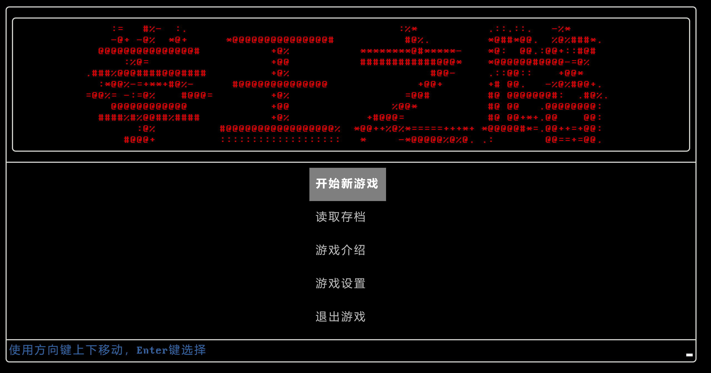
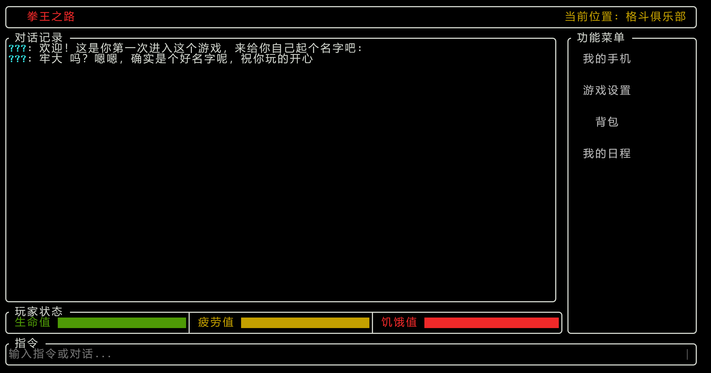

# 2025_OUC_MUDGAME

2025年程序设计基础实践-MUD游戏开发

- 游戏名：拳王之路
- 开发团队人数：5

## API

### Game 类

游戏的核心控制类，负责协调各个模块之间的交互和管理游戏状态。

**主要方法：**
- `Game()` - 构造函数，初始化游戏各组件
- `~Game()` - 析构函数（待实现）
- `run()` - 启动游戏主循环
- `startNewGame()` - 开始新游戏，显示加载界面并初始化游戏进程
- `loadGame()` - 加载存档，显示加载界面
- `showGameIntro()` - 显示游戏介绍界面
- `showGameSettings()` - 显示游戏设置界面
- `exitGame()` - 退出游戏
- `getDialog()` - 获取对话系统指针
- `getPlayer()` - 获取玩家角色指针

**全局变量：**
- `SYSTEM` - 系统消息发送者名称
- `PLAYER` - 当前玩家名称
- `VOICEOVER` - 旁白标记
- `UNKNOWN` - 未知角色标记（"???"）

### View 类

负责游戏界面的渲染和用户交互处理，基于FTXUI库实现。

**主要方法：**
- `View(Game& game_logic)` - 构造函数，接收Game引用
- `showMainMenu()` - 显示主菜单界面，包含开始游戏、读取存档等选项
- `static showLoadingScreen(const std::string& subtitle)` - 显示加载进度条界面
- `showGameScreen()` - 显示游戏主界面
- `static showGameIntroScreen()` - 显示游戏介绍界面，包含可滚动文本内容
- `makeGameLayout(...)` - 创建游戏界面布局，包含对话记录、输入框和功能按钮

### Dialog 类

负责游戏中的对话系统，管理对话历史和处理玩家输入。

**主要方法：**
- `Dialog(Game& game_logic)` - 构造函数，接收Game引用
- `addMessage(const std::string& who, const std::string& content)` - 添加一条消息到对话历史
- `processPlayerInput(std::string& input)` - 处理玩家输入的命令或对话
- `getHistory()` - 获取对话历史记录，用于界面渲染

**结构体：**
- `DialogMessage` - 存储单条对话信息的结构体，包含发送者、内容和显示时间

### Player 类

代表玩家角色，管理玩家的各项属性和状态。

**主要方法：**
- `Player(Game& game_logic)` - 构造函数，接收Game引用
- `~Player()` - 析构函数（待实现保存数据功能）
- `getName()` / `setName()` - 获取/设置玩家名称
- **核心属性管理：**
  - `getHealthiness()` / `addHealthiness()` - 健康度
  - `getStrength()` / `addStrength()` - 力量
  - `getStamina()` / `addStamina()` - 耐力
  - `getAgility()` / `addAgility()` - 敏捷
  - `getHunger()` / `addHunger()` - 饱食度
  - `getFatigue()` / `addFatigue()` - 疲劳值
  - `getSavings()` / `addSavings()` - 积蓄（金钱）
- **派生属性获取：**
  - `getSpeed()` - 速度（基于敏捷属性计算）
  - `getHealth()` - 血量（待完善）
  - `getEnergy()` - 体力槽（待完善）

## 操作 / Control

TODO

## 实机截图 / Screenshot

## 构建 / Build

### **Windows**

1. 确定自己本地有 cmake 环境
2. 运行 `build.bat` 即可构建
3. 如果使用 CLion 等 IDE ，加载 CMake 项目后点击构建按钮即可

### **Linux**

TODO

## 待办 / TODO

- [x] 对话显示
- [x] 主界面
- [x] 游戏介绍页
- [ ] 任务系统
- [ ] 背包系统
- [ ] 存档及加载存档
- [ ] NPC 对话、交互
- [ ] 商店、健身房、比赛场、家 等场景
- [ ] 战斗系统、技能系统
- [ ] 食物、药物
- [ ] 基本剧情(1~3章)
  

## 参考资料 / Reference

[实验大纲](docs\reference\程序设计基础实践-实验大纲_2025.pdf)

## 贡献者 / Contributor

## 协议 / License

[MIT License](LICENSE)
